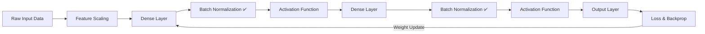

<div align="center">

# 📊 Batch Normalization in ANN

### A Deep Learning Practice Example

[](https://www.python.org/)
[](https://www.tensorflow.org/)
[](https://keras.io/)
[](https://jupyter.org/)
[](https://numpy.org/)
[](LICENSE)

<br/>

> *A focused, hands-on implementation of Batch Normalization — one of the most impactful techniques in modern deep learning for faster training and stronger generalization.*

<br/>

[📖 Overview](#-overview) • [💡 What is Batch Normalization?](#-what-is-batch-normalization) • [⚙️ How It Works](#%EF%B8%8F-how-it-works) • [✅ Key Benefits](#-key-benefits) • [📁 Project Structure](#-project-structure) • [🚀 Getting Started](#-getting-started) • [🔧 Requirements](#-requirements)

---

</div>

## 📖 Overview

This repository contains a clean, practical implementation of **Batch Normalization** applied to an Artificial Neural Network (ANN) using Keras and TensorFlow. The notebook demonstrates the technique's direct impact on training stability, convergence speed, and model accuracy — making it an ideal reference for anyone studying deep learning optimization strategies.

Batch Normalization is now a **standard component** in virtually every state-of-the-art deep learning architecture, and understanding it from first principles is essential for any deep learning practitioner.

<br/>

## 💡 What is Batch Normalization?

**Batch Normalization** (Ioffe & Szegedy, 2015) is a technique that normalizes the **inputs to each layer** within a mini-batch during training. Rather than only normalizing the raw input features once at the start, Batch Norm ensures that the distribution of activations stays stable throughout the entire network — layer by layer, at every training step.

This directly solves the problem of **Internal Covariate Shift** — the phenomenon where the distribution of layer inputs keeps changing as the weights of previous layers are updated, destabilizing training.

```
Without Batch Norm                         With Batch Norm
──────────────────────────────             ───────────────────────────────
Input → Dense → Dense → Output             Input → Dense → BN → Dense → BN → Output
         ↓                                                  ↓
  Unstable activation                              Stable, normalized
  distributions per layer                          activations per layer
  → Slow training                                  → Fast, smooth training
  → Needs low learning rate                        → Tolerates higher learning rates
  → Sensitive to initialization                    → Less sensitive to init
```

<br/>

## ⚙️ How It Works

Batch Normalization is applied after the linear transformation of a layer (and typically before the activation function). For each mini-batch of size **m**, it performs four steps:

<br/>

**① Compute the Mini-Batch Mean**
```
μ_B = (1/m) · Σ xᵢ
```

**② Compute the Mini-Batch Variance**
```
σ²_B = (1/m) · Σ (xᵢ − μ_B)²
```

**③ Normalize the Inputs**
```
x̂ᵢ = (xᵢ − μ_B) / √(σ²_B + ε)         ← ε prevents division by zero
```

**④ Scale and Shift with Learnable Parameters γ and β**
```
yᵢ = γ · x̂ᵢ + β
```

> **γ** (gamma) and **β** (beta) are learned during backpropagation. They allow the network to **undo** the normalization if it turns out normalization is not beneficial for a particular layer — giving the network full expressive flexibility.

<br/>

### 🔁 Training vs. Inference

| Phase | Mean & Variance Used |
|-------|----------------------|
| **Training** | Computed from the current mini-batch |
| **Inference** | Uses running averages of mean & variance accumulated during training |

<br/>

## ✅ Key Benefits

| Benefit | Description |
|---------|-------------|
| 🚀 **Faster Training** | Allows use of higher learning rates without divergence |
| 🧱 **Reduces Sensitivity to Initialization** | Less dependent on careful weight initialization |
| 🛡️ **Acts as Regularization** | Adds slight noise via batch statistics, reducing need for Dropout |
| 📉 **Combats Vanishing / Exploding Gradients** | Keeps activations in a healthy range across all layers |
| 🏗️ **Enables Deeper Networks** | Makes it practical to train very deep architectures stably |

<br/>

## 📁 Project Structure

```
📦 Batch-Normalization-in-ANN-DL
│
├── 📓 batch_norm_example.ipynb     # Full implementation: ANN with & without Batch Norm
│
└── 📄 README.md
```

### 📓 What's Inside the Notebook?

The notebook `batch_norm_example.ipynb` covers:

- ✅ Building a baseline ANN **without** Batch Normalization
- ✅ Building the same ANN **with** `BatchNormalization()` layers added
- ✅ Training both models and comparing loss / accuracy curves
- ✅ Observing faster convergence and improved stability with Batch Norm

<br/>

## 🧠 Implementation at a Glance

```python
from tensorflow.keras.models import Sequential
from tensorflow.keras.layers import Dense, BatchNormalization, Activation

# ANN with Batch Normalization
model = Sequential([
    Dense(64, input_shape=(X_train.shape[1],)),
    BatchNormalization(),           # ← Normalize after Dense, before Activation
    Activation('relu'),

    Dense(32),
    BatchNormalization(),           # ← Applied between every Dense layer
    Activation('relu'),

    Dense(1, activation='sigmoid')  # ← Output layer (binary classification)
])

model.compile(optimizer='adam', loss='binary_crossentropy', metrics=['accuracy'])
model.fit(X_train, y_train, epochs=50, batch_size=32, validation_split=0.2)
```

> 💡 **Best Practice:** Place `BatchNormalization()` **after** `Dense()` and **before** the `Activation()` function for optimal results.

<br/>

## 🚀 Getting Started

### 1. Clone the Repository

```bash
git clone https://github.com/sanzidd/Batch-Normalization-in-ANN-DL.git
cd Batch-Normalization-in-ANN-DL
```

### 2. Install Dependencies

```bash
pip install tensorflow keras numpy pandas matplotlib jupyter
```

### 3. Launch the Notebook

```bash
jupyter notebook batch_norm_example.ipynb
```

Run all cells from top to bottom. The notebook is self-contained and walks you through the full example step by step.

<br/>

## 🔧 Requirements

```
Python        >= 3.8
TensorFlow    >= 2.0
Keras         (bundled with TensorFlow 2.x)
NumPy         >= 1.19
Matplotlib    >= 3.3
Jupyter       >= 1.0
```

<br/>

## 📈 Where Batch Normalization Fits in the DL Pipeline



<br/>

## 🔗 Related Projects

Explore the rest of my Deep Learning practice series:

| Repository | Topic |
|------------|-------|
| [Improving Neural Network Performance](https://github.com/sanzidd/Improving-the-Performance-of-a-Neural-Network-DL) | Dropout, Regularization, Early Stopping, Feature Scaling |
| [Weight Initialization Techniques](https://github.com/sanzidd/Weight-Initialization-techniques-In-ANN-DL) | Zero Init, He Init, Xavier / Glorot Init |
| **Batch Normalization** ← you are here | BatchNorm in ANN with Keras |

<br/>

## 🤝 Contributing

Have an idea to extend this example (e.g., Layer Normalization, Group Normalization)? Contributions are welcome!

1. Fork the repository
2. Create a new branch: `git checkout -b feature/layer-norm`
3. Commit your changes: `git commit -m "Add: Layer Normalization comparison"`
4. Push and open a Pull Request

<br/>

## 📄 License

This project is open-source and available under the **MIT License**.

<br/>

<div align="center">

---

Made with ❤️ by [sanzidd](https://github.com/sanzidd)

*Found this useful? Give it a ⭐ to support the work!*

</div>
